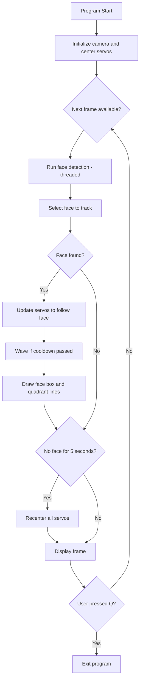

# Wavebot Face Tracker

A Raspberry Pi‑powered robot that detects faces with OpenCV, tracks them with two eye servos (plus neck pan) and greets people with a mechanical wave. All logic is pure‑Python; if the PCA9685 driver board or a camera is missing the code automatically switches to simulation mode so you can still develop and test.

---

## Project layout

    .
    ├── main.py                 # Program entry‑point & control loop
    ├── calibrate.py            # Interactive / one‑shot servo‑calibration helper
    ├── README.md               # (this file)
    └── wavebot/                # Package
        ├── __init__.py         # Re‑exports for convenience
        ├── camera.py           # PiCamera / USB‑cam abstraction
        ├── config.py           # Tunables, centres & limits
        ├── servos.py           # Low‑level PWM + high‑level motions
        └── vision.py           # Haar‑cascade detection + tracking

---

## Hardware requirements

| Part                                       | Notes                                                |
| ------------------------------------------ | ---------------------------------------------------- |
| Raspberry Pi (any model with I²C + camera) |                                                      |
| Camera module **or** USB webcam            | 320 × 240 @ 30 FPS default                           |
| Adafruit PCA9685 16‑channel PWM HAT        | Drives up to 16 servos over I²C                      |
| Micro servos                               | 2 × eyes, 1 × neck (pan), 1 × hand                   |
| Adequate 5 V supply                        | Servos **must not** be powered from the Pi’s 5 V pin |

---

## Quick‑start

    # 1 – enable interfaces
    sudo raspi-config            # turn on I²C and Camera

    # 2 – install dependencies
    sudo apt update
    sudo apt install python3-pip libatlas-base-dev python3-picamera
    pip3 install --upgrade pip
    pip3 install opencv-python adafruit-circuitpython-servokit

    # 3 – run it
    python3 main.py              # press q to quit

If no PCA9685 or camera is detected the program logs a warning and runs in **simulation mode** (servo commands are logged but nothing moves).

---

## Configuration highlights

| Setting                        | Default value      | File        |
| ------------------------------ | ------------------ | ----------- |
| `FRAME_WIDTH` / `FRAME_HEIGHT` | 320 × 240 px       | `config.py` |
| `USE_USB_CAMERA`               | `False` (PiCamera) | `config.py` |
| `EYE_LEFT_X_CENTER`            | 135°               | `config.py` |
| `EYE_RIGHT_X_CENTER`           | 125°               | `config.py` |
| `NECK_X_CENTER`                | 70°                | `config.py` |
| `HAND_RIGHT_CENTER`            | 45°                | `config.py` |
| Wave interval                  | 5 s                | `main.py`   |

Change these constants to match your mechanical build; no other code edits are required.

---

## Calibrating servos

    # list available channels
    python3 calibrate.py --list-channels

    # set a single servo once
    python3 calibrate.py --channel EYE_LEFT_X --angle 140

    # fully interactive mode
    python3 calibrate.py

Angles are automatically clamped to the limits in `SERVO_LIMITS`.

---

## How it works

1. **Frame capture** – `camera.py` yields frames from PiCamera or a USB webcam.
2. **Face detection** – `vision.py` runs a Haar cascade classifier on a background thread.
3. **Face tracking** – the largest or most continuous face is chosen; its pixel offset from centre is fed to `update_servos()`.
4. **Servo mapping** – `servos.py` applies a sigmoid easing function for smooth motions. Because the right‑eye servo is mirrored, its offset is negated so both pupils track together.
5. **Wave greeting** – when a face is present (and the 5‑second cooldown has elapsed) the hand servo sweeps 0 → 90 → 0 twice in its own thread.
6. **Timeout recenter** – if no face is seen for 5 s, `center_servos()` restores all channels to their centre constants.

---

## Flowchart

---

## Servo channel map

| Enum value        | Physical servo         | Centre (deg) |
| ----------------- | ---------------------- | ------------ |
| `EYE_LEFT_X (0)`  | Left eye – horizontal  | 135          |
| `EYE_LEFT_Y (1)`  | Left eye – vertical    | — (reserved) |
| `EYE_RIGHT_X (2)` | Right eye – horizontal | 125          |
| `EYE_RIGHT_Y (3)` | Right eye – vertical   | — (reserved) |
| `HAND_RIGHT (4)`  | Arm / hand             | 45           |
| `NECK_X (8)`      | Neck pan               | 70           |
| `NECK_Y (9)`      | Neck tilt              | — (reserved) |

---

## Troubleshooting

| Symptom                          | Remedy                                                           |
| -------------------------------- | ---------------------------------------------------------------- |
| “Hardware not available” in logs | Check I²C wiring; confirm `i2cdetect -y 1` shows address `0x40`. |
| No video window or black preview | Reseat camera ribbon; test with `raspistill -t 1000`.            |
| Eyes diverge or go cross‑eyed    | Re‑adjust `EYE_*_CENTER` or re‑horn servos.                      |
| Neck oscillates                  | Increase the dead‑zone by tweaking `width // 6` in `servos.py`.  |

---

## License

MIT – hack away and share your builds!
